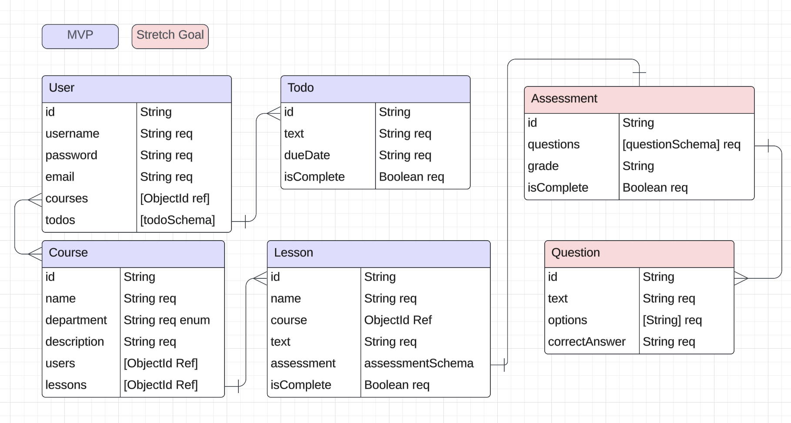

# BrightMind

**A student-driven approach to learning.**

Current backend for BrightMind app. Currently can create a user, join preset dummy classes as a user, and can create todo items. Wanted to try building this as a precursor to an app when teachers can post their classes online and students can join the classes to work through the lesson at their own pace.

Github Repo: [BrightMind Frontend Repo](https://github.com/TGadaleta/BrightMind-frontend)

## Tech Used

This backend was build using bcrypt, cors, dotenv, express, jsonwebtoken, mongoose, morgan, and nodemon.

## Database Configuration (ERD)

## Routing Table
| Name               | Route                                       | Use                        | Method |
|--------------------|----------------------------------------------|----------------------------|--------|
| getCourses         | /courses                                    | Get all courses            | GET    |
| getCourse          | /courses/:courseId                         | Get a course               | GET    |
| signIn             | /users                                      | Sign into app              | POST   |
| signUp             | /users/signup                              | Create user                | POST   |
| getUserCourses     | /users/:userId/courses                    | View all courses as user   | GET    |
| addCourse          | /users/:userId/courses/:courseId          | Add course to user         | PUT    |
| dropUserCourse     | /users/:userId/courses/:courseId/drop          | Drop enrolled course       | PUT    |
| getUserTodos       | /users/:userId/todos                      | Get all user todos         | GET    |
| createUserTodo     | /users/:userId/todos                      | Create user todo           | POST   |
| editUserTodo       | /users/:userId/todos/:todoId              | Edit user todo             | PUT    |
| deleteUserTodo     | /users/:userId/todos/:todoId              | Delete user todo           | DELETE |
| getLessons         | /users/:userId/courses/:courseId/:lessonId| Get single lesson          | GET    |